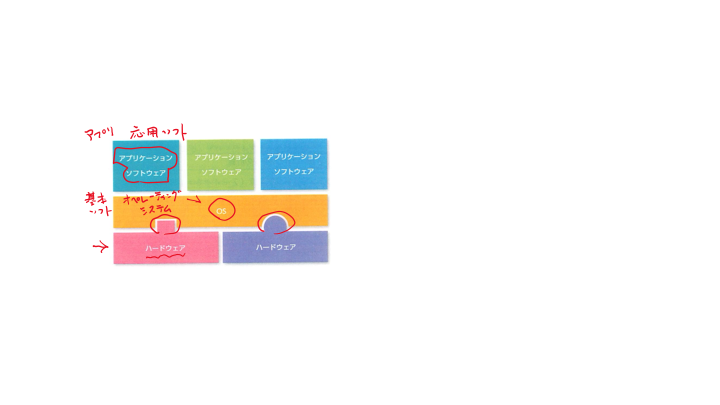

#+qiita_private: 6da22dcc92530d44b5ce
#+OPTIONS: ^:{}
#+STARTUP: indent nolineimages overview num
#+TITLE: コンピュータ演習A 25 : Day2(4/21) - 気づき, 青山タイプ
#+AUTHOR: Shigeto R. Nishitani
#+EMAIL:     (concat "shigeto_nishitani@mac.com")
#+LANGUAGE:  jp
#+OPTIONS:   H:4 toc:t num:2
#+TAG: Python, Windows
#+SETUPFILE: https://fniessen.github.io/org-html-themes/org/theme-readtheorg.setup

* 先週の復習
- [[https://qiita.com/daddygongon/items/b0bf7fa06a3dd601529c][AM/PMて知ったはる?]]
#  - 
| ![[https://qiita-image-store.s3.ap-northeast-1.amazonaws.com/0/151211/f7d2b992-2bc3-4017-b1ef-138d124d9946.png][d1_pc.001.png]] |
| アプリとOS     |

* 授業内容（タッチタイプ）
** 気づき
- [[https://www.youtube.com/watch?v=KB_lTKZm1Ts][YouTube Awareness test]]
- 気づかないと, 見えない，覚えられない
- 気づけば, ずっと見える，覚えてる
# - それが学習の非対称性，非可逆性（専門用語はわからず）
# 情報の非対称性(レモン(腐った中古車)の原理は少し違う)
** [[https://qiita.com/daddygongon/items/04377537f01674ec81db][青山タイプ]]
** [[https://kwanseio365-my.sharepoint.com/:b:/g/personal/cru32369_nuc_kwansei_ac_jp/EeLpuhnVJOtDonY7T5hehgMBKgmJSRBShAoJinzW18EC3w?e=l7NZOK][デスクトップ確認と修正]]
- ソフトウェア
- GUI(こっち) vs CUI(あっち)
  - Computer for the rest of us.
  - WYSIWYG(単なる見かけ, just a view.)
  - OS デスクトップ操作イメージ(メタファ,比喩，たとえ)で！
    - 操作法の統一感
    - keyboard shortcut(Ctrl-Shift-P?)
  - 英語化
    - 設定 > 時刻と言語 > 言語 から英語をインストールし,
      Windows の表示言語から英語を選択．
- 次の単語の場所を配布したプリントの中に書きこみ，意味を考えなさい
    #+begin_quote
    アイコン，ショートカットアイコン，デスクトップ，ステータスバー，スタートアイコン，スタートメニュ，設定，サイズ，言語，IME,

    メニューバー，タブ，タイトルバー，ツールバー，アドレスバー，Explorer，検索
    #+end_quote

** 初期変更(私の場合)
1. 設定
  1. フォントサイズ，マウスサイズ
  1. タッチパッド，右クリックは2本指のみ
  1. IME -> キーとタッチでIME-on/off
  1. 個人用設定>タスクバー>自動的に隠す
1. エクスプローラexplorer
  - コンパクトビュ，詳細，時間順に並べる，拡張子
  - タイトルバーに完全なパスを表示する
  - デフォルトに
* 課題
- aoyamatypeをinstall, exec(ute, 実行)しなさい
- 青山タイプの
  - 時間チェック(-c check)の結果
  をLUNAへtextで提出しなさい．

