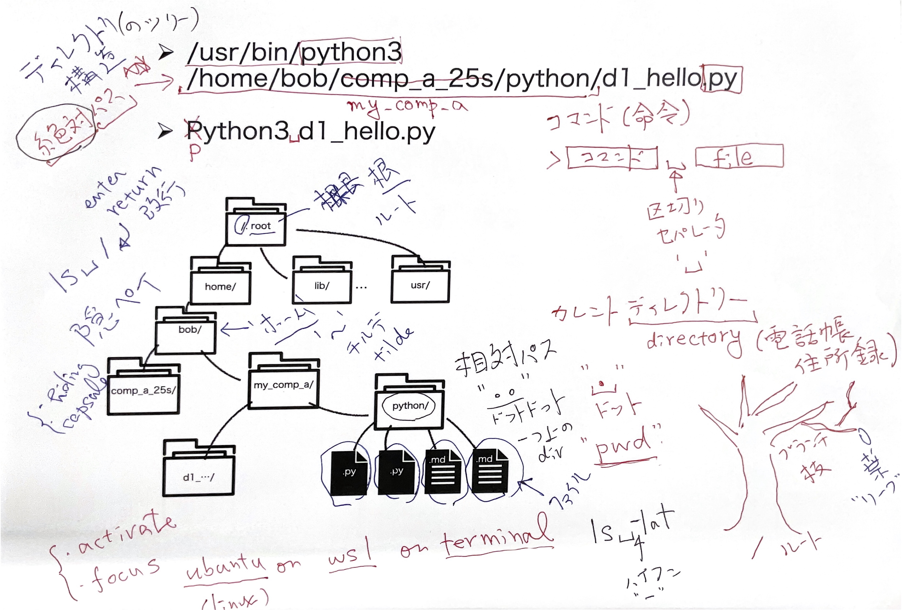

# まなぶ項目

-   記憶の対決
-   path, directory tree
    -   python3 d1_hello.py
        -   pwd
        -   echo \$PATH

# six elements

-   [プログラミング言語の６つの要素(GoodNote)](https://ist.ksc.kwansei.ac.jp/~nishitani/CompAInfo/24s/index.html)

# 課題

## 「記憶の構造」プレゼン参加者
プレゼンの勝者，敗者の全ての参加者の学籍番号と氏名をリストにしてメモに貼り付けなさい．

## FizzBuzz

if-elseの2-3-6にならって， 次のFizzBuzz問題

-  1から順番に数字をprint．

-  3で割り切れるときは"Fizz"とprint．

- 5で割り切れるときは"Buzz"とprint．

-  両方で割り切れるときは"FizzBuzz"とprint．

を解きなさい．

 > python3 fizz_buzz.py > result_fizz_buzz.txt

に保存しなさい．

## sum_up(2, 100)

1.  関数tashizanを書いたfileをsum_up.pyとして保存しなさい．

2.  関数tashizanの名前をsum_upとします．

3.  dif=2, total_max=100として呼び出しなさい．

4.  結果を

    \> python3 sum_up.py \> result_sum_up.txt

に保存しなさい． 

## 提出
- 先週やったd1_python.mdを参考にして，
  - m2_basic_six.mdに
  - python_codes.py, results.txtを
    copy&pasteして
  - フォーマットを整えて，

  LUNAに提出してください．
- m2_basic_six.mdには今週初めて理解した
  - coding技法，
  - errorとその意味・改善策

  を具体的に記述しておくこと．

## オプション課題ナベアツ数(+1)

世界のナベアツは，数字を1から数えていくとき，
3の倍数および3のつく数の時にアホになる．
Pythonでナベアツの振る舞いを実装し，
1から100までの整数で確認するcodeを書きなさい．

# 課題に対するコメント

-   markdownフォーマット(iml86371)
    -   vscodeのプレビュー
    -   マークアップって印のこと
    -   wordでパーツを認識したよね?!
    -   title, head
    -   quote(引用)
        -   pythonブロック
        -   bash ブロック
    -   リスト
        -   数字リスト(number list)
        -   クロポチリスト(bullet list)
-   自分の初めて知ったことを書き加えて，
    -   「諸々知った」は良くない．何を具体的に知ったのかを書く方が，
        頭に残る．あるいは，あとで検索できる．
    -   抽象 ::
        名前を打ち込んで呼び出していく感覚を初めて知れた気がする。
    -   具象 ::
        コマンドラインからの引数によって，アプリケーションの振る舞いを変更する方法を知った．　とかね．
-   課題に，問題文(仕様)をつけるべき，
    どういう意図でのコードかわかんないから．
